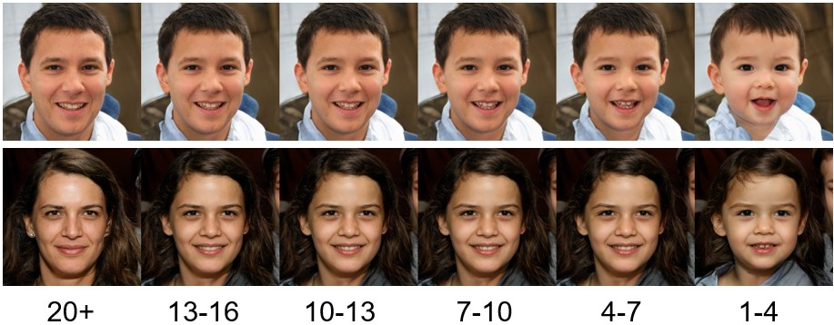

# HDA-SynChildFaces-AgeTransformation

Official repository of the paper "*Child Face Recognition at Scale: Synthetic Data Generation and Performance Benchmark*". 

<p align="center">
  
</p>

## Introduction

In the paper we addressed the need for a large-scale database of children's faces by using generative adversarial networks (GANs) and face age progression (FAP) models to synthesize a realistic dataset referred to as **HDA-SynChildFaces**. The created HDA-SynChildFaces consists of 1,652 subjects and a total of 188,328 images, each subject being present at various ages and with many different intra-subject variations. An example is given below for a single subject:

<p align="center">
  
</p>

The table below shows how the HDA-SynChildFaces compares to related datasets:

<p align="center">
  
</p>

Contrary to other works, the HDA-SynChildFaces dataset is demographically balanced concerning several factors such as race and gender. To balance a demographic attribute, for instance, the subject's race, the subject is moved across the learned race boundaries as illustrated below. 

<p align="center">
  
</p>

## Download 
The database is being made available for researchers from 2024 onwards. Interested researchers can download this database. Any commercial use/distribution of this database is prohibited. All the technical reports and papers that report experimental results from this database should provide acknowledgment and reference (see the Acknowledgement Section).

Link: https://cloud.h-da.de/s/pFpfkzbwkniS6gz    <br/>
Password: bK7bBjp8myRs

## Acknowledgement

If you use this dataset or associated work, please cite the following paper: 

```
@article{Falkenberg-HDASynChildFaces-Frontiers-2024,
	title        = {Child Face Recognition at Scale: Synthetic Data Generation and Performance Benchmark},
	author       = {M. Falkenberg and A. B. Ottsen and M. Ibsen and C. Rathgeb},
	year         = {2024},
	journal      = {Frontiers in Signal Processing}
}
```
